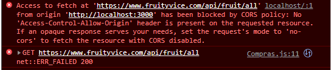

# NodeJs - ServidorAuxiliar
Devido a um problema de cors que estava ocorrendo em minha aplicação React, devidi criar este servidor para que fosse possivel eu realizar as requisições de minha aplicação a ele e posteriormente ele realizaria requisições a uma api externa, retornando então os dados que usaria em minha aplicação. 
Esta medida foi tomada devido a um erro que impossibilita que minha aplicação faça requisições diretamente ao provedor da Api.

Basicamente se eu requisitasse diretamente da aplicação para a api, se minha URL não estiver liberada para consumo da mesma, esta requisição então seria bloqueada. Porem este bloqueio ocorre quando a requisição é feita diretamente pelo navegador, como em casos de front-end. Criei então este servidor para que a comunicação fosse realizada entre os Back-ends, entre os servidores, assim não ocorreria o problema.

Link da aplicação: <https://github.com/FabricioSalustiano/React-Hortifruti-Flexco>
